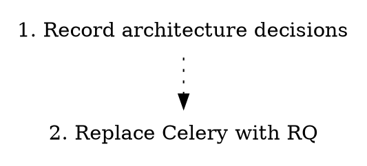

# Recorded decisions

```graphviz
digraph {
  node [shape=plaintext];
  subgraph {
    _1 [label="1. Record architecture decisions"; URL="0001-record-architecture-decisions.html"];
    _2 [label="2. Replace Celery with RQ"; URL="0002-replace-celery-with-rq.html"];
    _1 -> _2 [style="dotted", weight=1];
  }
}
```

- [1. Record architecture decisions](0001-record-architecture-decisions.md)

- [2. Replace Celery with RQ](0002-replace-celery-with-rq.md)
