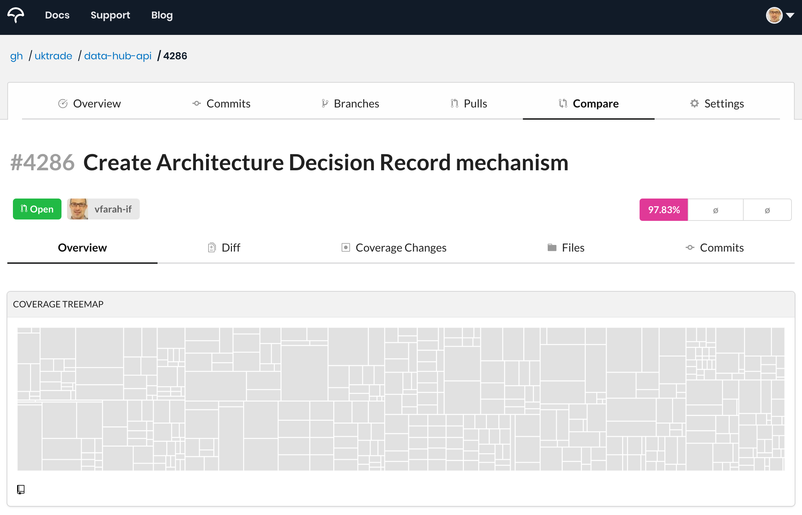

# Introduction

All test running is assumed from preparing and setting up document, see [**readme**](../README.md) for preparing docker and the basics on *Pytest* and other environmental requirements. 

## Environment

All commands are setup through the [**Makefile**](https://opensource.com/article/18/8/what-how-makefile), but can be run on the generated API images or locally utilising more **[Pytest](https://cheatography.com/nanditha/cheat-sheets/pytest/)** options

| Command                                                      | Description                                                  |
| ------------------------------------------------------------ | ------------------------------------------------------------ |
| `make build-tests`                                           | Builds Docker and then runs all the tests, slower and makes an assumption there are changes needed for Docker |
| `make tests`                                                 | Takes the already built image and runs all the tests, slightly faster way of running all the tests |
| `make run-test-reuse-db` or `pytest --reuse-db -vv <File(s)::test(s)>` | Configure specific test(s) to be run quicker, utilising the already  existing generated and seeded test database, cutting out the setup step |
| `make test` or `pytest <File(s)::test(s)>`                   | Configure specific test(s) to be run and will prepare and seed data needed for Django integration tests |
|                                                              |                                                              |

The **test coverage** is measured on Pull requests using https://app.codecov.io/gh/uktrade/data-hub-api

The tests, as well as code linters and code quality checks, are done through a micture of [**circleci**](https://app.circleci.com/pipelines/github/uktrade/data-hub-api) steps and *git actions* where failures and output details can be seen in detail. 

