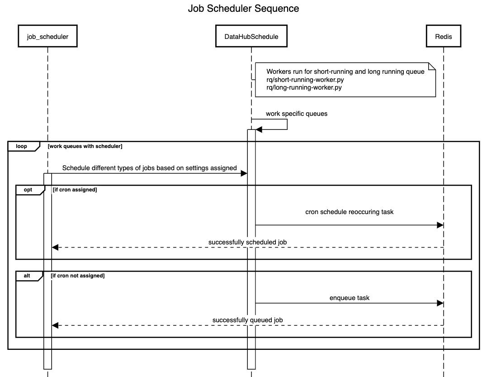

## Introduction

[RQ (_Redis Queue_)](https://python-rq.org/) is a simple Python library for queueing jobs and processing them in the background with workers. It is backed by Redis and it is designed to have a low barrier to entry.

From the rq docs:

> A job is a Python object, representing a function that is invoked asynchronously in a worker (background) process. Any Python function can be invoked asynchronously, by simply pushing a reference to the function and its arguments onto a queue. This is called enqueueing.

### Generic concepts to understand:

- Workers
  - These are services (when running on GovPaaS) or containers (when running locally on Docker). They loop through their assigned queues looking for jobs to process. They are started from the scripts `long-running-worker.py` and `short-running-worker.py`.
- Queues
  - These are just like real life queues, identified by unique strings (e.g. ‘long-running’). Jobs can be ‘enqueued’ on them, to be run asynchronously in order.
- Jobs
  - A job represents a function to be called by the worker.

### Datahub specific code:



- [Job_scheduler](https://github.com/uktrade/data-hub-api/blob/main/datahub/core/queues/job_scheduler.py)
  - This is the main interface to enqueue jobs. Based on the arguments it will either call DataHubScheduler’s `enqueue` or `cron` functions.
- [DataHubScheduler](https://github.com/uktrade/data-hub-api/blob/main/datahub/core/queues/scheduler.py)
  - This is the class to ensure that we start workers and enqueue or schedule jobs in a consistent way.
- Rate Limit Library
  - [Python redis rate limit library](https://github.com/EvoluxBR/python-redis-rate-limit) to helping to enforce a set rate to help with reducing or throttling the load, especially for usage with 3rd party API's that enforce this.

## How to schedule a job

First decide if it's a one off job, or you want to it to repeat regularly.

### enqueue

(schedule to run when it reaches the front of a queue)

1. Call `job_scheduler()` with the function you want to get called, e.g. `job_scheduler(hello_world)` some more [examples are in the tests](https://github.com/uktrade/data-hub-api/blob/main/datahub/core/test/queues/test_job_scheduler.py)
1. You can configure args and kwargs for the function, and override the default queue, set intervals etc.

#### cron

(repeat job at set intervals/times)

1. The same as step 1 above, but pass in a `cron` value and it will repeat accordingly. There are [constants for some often used cron values.](https://github.com/uktrade/data-hub-api/blob/main/datahub/core/queues/cron_constants.py). Cron tasks listed in `./cron-scheduler.py` are automatically scheduled when the service (re)starts. 
Note: Cannot be used if time_delta is defined.

#### time_delta

(Schedules the job to run at X seconds/minutes/hours/days/weeks later) 
1. The same as step 1 above, but pass in a `time_delta` value. 
Note: Cannot be used if cron is defined.

## Writing tests
When running tests jobs are scheduled but not executed (as the workers do not automatically run during tests). If you want to run a test that automatically runs the scheduled jobs include the fixture `async_queue`.

    def test_stores_notification_id(
        self,
        async_queue,
    ):
         # Code under test that calls job_scheduler will be executed. 

Additional examples in datahub/reminder/test/test_task.py/TestGeneratenoRecentInteractionReminderTask/test_stores_notification_id or various occurences of async_queue in datahub/core/test/.queues/test_scheduler.py.

## Monitoring RQ locally

This will allow you to monitor RQ locally, to see statistics like failures, successes, average duration and when most things were executed, as well as the queues defined for RQ.

The core service for facilitating RQ exported information is [RQ exporter](https://github.com/mdawar/rq-exporter). This will run on localhost:9726 to facilitate any RQ monitoring as data source. The configuration for the environment variables can be overridden, see more information at [Environment variable configuration](https://github.com/mdawar/rq-exporter#configuration). The datasource will be setup through _Prometheus_.

### Environment

**NOTE**: If you have a new or flushed docker system make sure you run `docker-compose -f docker-compose.yml -f docker-compose-rq-monitor.yml up --build` to build all the images or simply run `docker compose up --build` to build the core dependencies.

- Starting all the services `make start-rq-mon`
- Stopping all the services `make stop-rq-mon`

## Troubleshooting

1. Jobs are being queued but not started

   Means the service to work those queues has not been started or the started queue is blocking that from being started.

1. Jobs are failing
   These will stay failed for a long duration for the purposes of flagging issues, potentially writing code to requeue failed jobs and realign jobs that can pass under different circumstances and jobs that will never pass.

1. Scheduled jobs are being repeated/run too many times

   Cron jobs need to be canceled or they will run forever even if the app has restarted/been redeployed. Hence the `cancel_existing_cron_jobs` in the `cron-scheduler`. NOTE: this boot up file is also used to configure all the cron jobs that need configuration.

1. Check services are running

   Check docker dashboard to make sure all services are running as expected when jobs are set, and make sure if you have any jobs in environment variables, that you enable the variables to make sure the job gets scheduled.

## Utilities

### Monitoring

1. **Grafana**, locally on localhost:4000, under **RQ Dashboard**, can help with logging queues and statistics that get run or scheduled by RQ. Queues that get run will either pass or fail. NOTE: time to live expires data on redis so sometimes the statistics seem off over longer periods but fails persist for a long duration.

   

1. **RQ Monitoring** is a dashboard, locally on http://localhost:9181/, helps with seeing the same details on a more granual level, including the functionality to purge, depending on the queue. Navigate to jobs for clearing and visualising the data that is transmitted. Navigate to workers to see worker information. Note: schedule information is not available and cron sheduler data is not visible either, can only be seen in redis.

   

1. Dev tools like checking queues and rate limiting, can be done through a command tool, see help for more details.

   ```bash
   python manage.py test_rq --generated_jobs 100000
   ```

### Purging queues

Sometimes this is necessary when developing jobs, when you realise that something is wrong or not intentional, and you have a job generating many jobs that will always fail. Above is the RQ monitoring tool for doing it locally. For production, there is a python django command tool for purging queues, see purge_queue help for more details.

```bash
python manage.py purge_queue long-running --queue_state queued
```

### Tracing issues

**Elk** is the esasiest way to trace and monitor problems, by correlation ids or job ids, so be sure to add logging for traceability. NOTE: when logging a large stream of data, sometimes data gets lost based on the stream restriction, so don't be alarmed if your data is missing, just look at the result of what you were processing based on a summary of expectations logged.

### Exponential backoff calculator

Sometimes you need to calculate intervals for setting specific values at irregular times. There are several functional ways of doing this, can configure the **job_scheduler** with _retry_backoff=True or 60_. There is an exponential_backoff function to help do that by function and finally there is a website, [exponentialbackoffcalculator.com](https://exponentialbackoffcalculator.com/) that can help configure this by different exponentail values, and then you can simply configure the _retry_intervals_ on job_scheduler.


### Cron settings

The cron expression is made of five fields. Each field can have the following values. [crontab.cronhub.io](https://crontab.cronhub.io/) is a great way to visualise the settings created.


